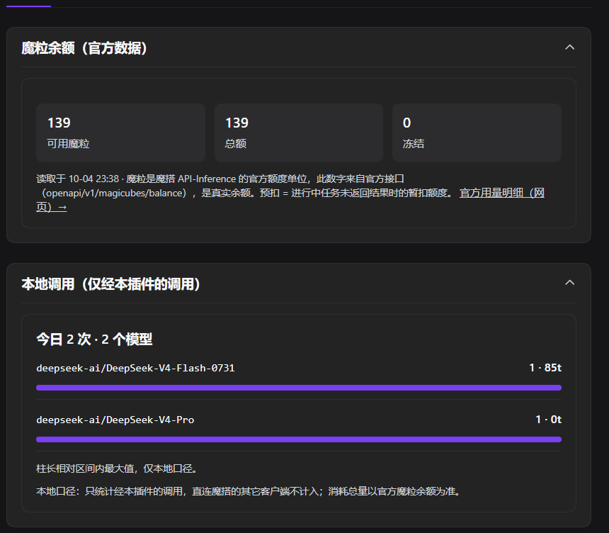
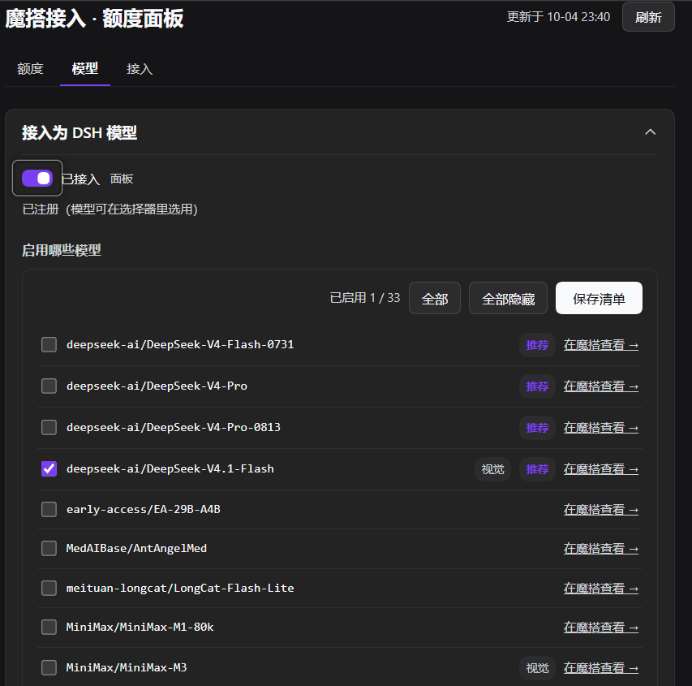

# dsh-connect-modelscope-token-plan

把魔搭社区（modelscope.cn）**API-Inference 免费额度**的本地用量面板接入 DeepSeek Harness 的 Plugins 页（插件卡内联，三个 tab：额度 / 模型 / 接入），并可选把魔搭注册成 **DSH 的 LLM provider**（id `modelscope-token-plan`，直连 `apiBase`，OpenAI 兼容）——注册后魔搭模型进入 DSH 模型选择器，可直接对话调用。见 [docs/PROVIDER-M4.md](docs/PROVIDER-M4.md)。

姊妹插件：`dsh-connect-sensenova-token-plan`、`dsh-connect-agnes-token-plan`（同族结构，受控复制）。

**状态：M4 已落地（provider 注册 + 面板「接入为 DSH 模型」），离线测试与 typecheck/build 全绿。**

## 面板长什么样

三个 tab：**额度 / 模型 / 接入**。

**「额度」tab**——头条是官方魔粒余额（真实值），下面接本地调用分布：

**「模型」tab**——一行一个魔搭模型，可勾选启用；开关打开即把魔搭注册为 DSH provider：

## 三条事实（写代码前先认清）

1. **官方有「魔粒」余额端点**：`GET {siteBase}/openapi/v1/magicubes/balance`（Bearer 访问令牌，匿名 401），返回 `{success, data:{total_balance, available_balance, frozen_amount}}`（2026-10-04 实测，见 [docs/SPIKE.md](docs/SPIKE.md)）。推理响应本身仍不带任何额度头。
2. **本地计数是辅助口径**：面板头条是官方魔粒余额；本地计数只回答官方余额答不了的问题——按模型分布、本地趋势、429 事件流（只统计经本插件的调用，直连魔搭的其它客户端不计入）。次数口径的「推算剩余/参考上限」已从面板移除（官方改魔粒计费后两个单位并排是误导），相应的 `dailyQuotaTotal` / `dailyQuotaPerModel` 两个社区快照常数也从配置里一并删除了——面板不消费它们，留着只会让人以为能算「还剩几次」。
3. **凭据只有一把静态钥匙**：魔搭访问令牌（个人中心生成，形如 `ms-…`），无 OIDC、无密码、无 refresh。默认读 DSH 凭据服务已有的 `MODELSCOPE_API_KEY` 引用，`MODELSCOPE_API_KEY` 环境变量作回退；令牌永不入日志、永不进插件目录。

## 免费额度怎么算（2026-10 快照，以官方为准）

- 每日免费调用次数按账户计（当前约 2000 次/天，需绑定阿里云 + 实名；规则多次调整过）；
- 单模型另有每日上限（社区数据约 500 次/天）与每分钟限频；
- 额度按天重置；耗尽返回 429。
- `/v1/models` 免认证可读，**不消耗额度**。

上面这些数字来自社区公开信息，非官方数据，官方调整后需手动更新本节；**它们只用于解释
「额度怎么算」，不参与任何计算**——面板不消费次数上限，「还剩几次」算不出来（见下节）。

## 文档地图

| 何时 | 查 |
|---|---|
| 「上游到底有没有额度信号」 | [docs/SPIKE.md](docs/SPIKE.md)（实测记录 + 结论） |
| provider 怎么接入（写代码前） | [docs/PROVIDER-M4.md](docs/PROVIDER-M4.md)（实现契约） |
| **这版是怎么做出来的、踩过什么坑** | [docs/IMPLEMENTATION.md](docs/IMPLEMENTATION.md)（实施过程档案） |
| 上游端点全景 / 第三方方案对比 | [docs/REFERENCES.md](docs/REFERENCES.md)、[docs/REFERENCE-modelsdev.md](docs/REFERENCE-modelsdev.md) |
| v1 要做什么、做到哪了 | [docs/ROADMAP.md](docs/ROADMAP.md) |
| Host/Client 两半怎么分 | [docs/PROVIDER-M4.md](docs/PROVIDER-M4.md)（§14 红线）＋ [docs/IMPLEMENTATION.md](docs/IMPLEMENTATION.md)；本仓库暂无独立的 `ARCHITECTURE.md` |
| 开发者校验工具（变异测试 / 覆盖率） | [tools/dev/README.md](tools/dev/README.md)；发布流程见 [RELEASING.md](RELEASING.md) |

## 诚实声明

- 面板头条是**官方魔粒余额**（真实值）；本地计数只统计**经本插件的调用**——它回答的是分布/趋势/429 事件流，不是余额，直连魔搭的其它客户端不计入。注册 provider 之后，DSH 的全部魔搭调用都经本插件，所以本地计数**覆盖全部 DSH 魔搭调用**。次数口径的「推算剩余」已从面板移除（官方改魔粒计费后两单位并排是误导），相应地`quota.daily` 只剩 `usedLocal` 一个数——没有 `limit`，也没有推算出的「剩余」。
- **本地计数的口径与 harness 全局账本不同，且刻意不合并**。DSH 自己有 `@linxin666/dsh-usage`，按 `days→provider→model` 记成功调用的 token；它只订阅 session 的 `assistant/message`，**失败调用一次都不记**。所以本插件只做两件全局账本答不了的事：①「经本插件的调用分布与趋势」；②**429/错误事件流**——这是本插件的独家数据（官方只给总额度余额，不给「哪个模型刚才在限频」）。成功的 token 总量不在此重复记账（详见 `src/host/usage-observer.ts` 文件头）。
- 429/错误事件的分类读的是 **`llm-error-fix` 重分类之后**的 code：被误判成 QUOTA 的 rpm 限频在事件流里记作 `rate_limit`，与退避策略说同一件事。观察层套在重分类层**之外**，顺序不可反。
- **计数口径**：每次流结束记一次 call，**含失败、含用户中断**（魔搭按次数计费，限频掉的请求同样是一次调用）；token 数上游没给时是 `null` 而非 0。偏差方向是**按流计次**：重试不在流内部发生，而是在流消费完后由 `agent/request-error` 瀑布决定重发，因而**每次重试各记一次**——按「魔搭按次数计费」的口径这反而是对的（每次重发都真打了一次上游）。
- **provider 默认关**（opt-in，与姊妹插件一致）：面板「模型」tab 的「接入为 DSH 模型」开关翻转即生效，面板保存值优先于 `cordis.patch.yml` 的 `registerProvider` 默认。
- **已知限制：`reasoning` 恒为 false**。魔搭 API-Inference 是多模型代理，是否吃 `reasoning_effort` 取决于背后那个模型；本插件无法离线得知每个 id 的档位表，保守默认不发该参数（模型用自己的默认），也不提供思考强度选择器。「宁可不选，不可错发」——发错档位会整条请求 400。见 [docs/PROVIDER-M4.md](docs/PROVIDER-M4.md) §4。
- 429 响应形状未实测（不值得烧额度去触发），解析按 OpenAI 惯例兼容，漂移时面板会给 `shapeWarnings`。
- 面板「模型」tab 的每个模型都外链到其魔搭详情页（`https://www.modelscope.cn/models/{owner}/{model}`）：魔粒单价只在网页展示、不在官方 API，所以这只是一个**人工核对用的跳转，不是数据源**（「为什么没有按模型消耗 API」见 [docs/REFERENCES.md](docs/REFERENCES.md)）。
